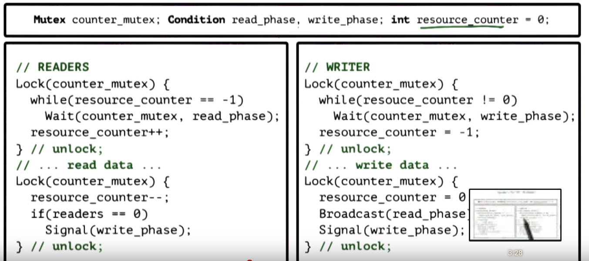
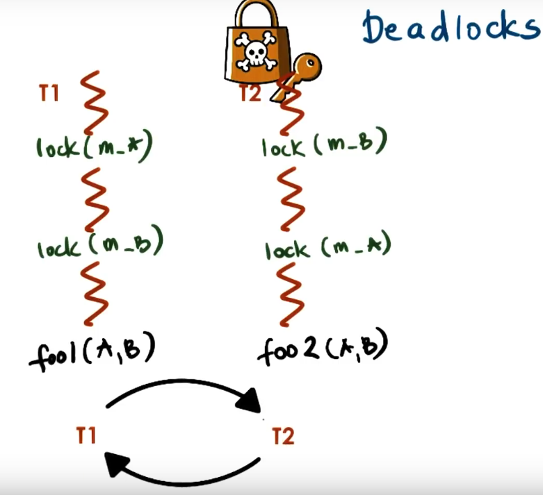
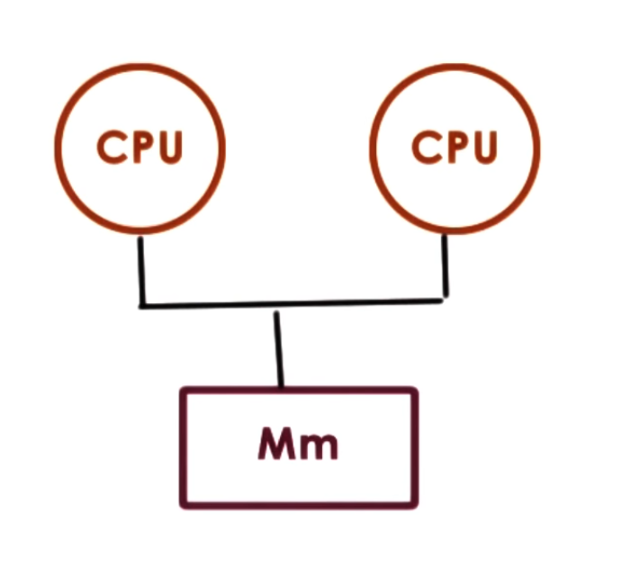
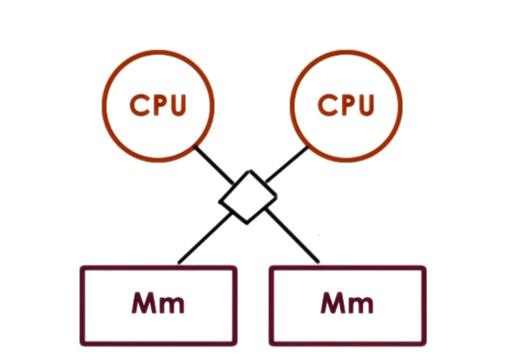
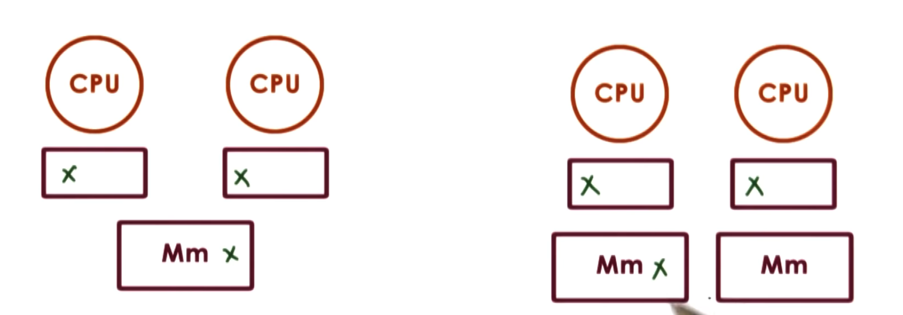

### Thread sync

What do we need to support threads:

* thread data structure -- to identify threads, keep track of resource usage, ...
* mechanisms to create and manage threads
* mechanism to sagely coordinate among threads running concurrently in same address space

*Data race* -- problem when multiple threads access same data at same time (concurrent writes, or concurrent write and read).

Concurrecy control:

* mutual exclusion -- exclusive access to only one thread a time
  * implemented as **mutex**
* waiting on other threads
  * also need to specify what are we waiting for -- specific *condition* before proceeding
  * implemented as **condition variable**

## Mutual exclusion

OS and threading libraries support abstract called *mutex* -- lock that should be used when
accessing data that is shared among threads.

* On **lock** (aquire) mutex, thread has exclusive access to resource
* Other threads that locks same mutex, will be blocked on this lock operation until mutex owner releases it

Mutex is a data structure that has

* locked flag
* owner
* list of blocked threads

**Critical section** -- portion of the code, protected by mutex.

## Producer/Consumer problem

What if processing you wish to perform with mutual exclusion needs to occur only under
certain conditions?

For ex., there are some **producer** threads that insert in linked list, and one **consumer** thread,
that prints this list and clears it. We want to run consumer's work only under *condition*: list is full.

This can be done with only mutex contruct: producer acquire a lock and only then perform condition check,
and if condition is false, releases mutex and tries to lock mutex again, ...

But this approach is wasteful, and better to tell consumer where the list is actually full.

## Condition variables

**Condition variable** -- used in conjunction with mutexes to control behaviour of concurrent threads.
With cond. var., consumer will **wait** until list is full. Producer, after insertion will check if list is full, and if it is,
send **signal** to consumer.

Both wait and signal operations used with special condition variable as argument, and both of them
are used **inside** critical section (with aquired mutex). On wait operation, consumer must also release
captured mutex, and capture it back once signal is received.

Summarizing, cond. var. must support following API:

* wait(mutex, cond)
* signal(cond) -- to send signal only for one waiting consumer
* broadcast(cond) -- to send signals for all waiting consumers (if there more than 1 consumer)

## Reader/Writer problem

We threads of 2 kind:

* that are only read shared state
* that are modifying shared state

Problem: we should have 0 or more readers at a time, but only 0 or 1 writer at a time AND if there are readers that accessing shared state,
then no writers should be that modify it (see def. of *data race*).

Problem cannot be solved just with mutex, because it is not allowed multiple readers to access shared state, but only one (too restrictive).

We can solve it by introducing integer counter, that is equal -1 if there are 1 writer, equal 0 if shared state is free, or N > 0 where N is number of readers.
currently accessing shared state.

We will control this counter with mutex, and additionaly have 2 cond. var.: *read phase* and *write phase*.



## Deadlocks

**Deadlock** -- situation in which concurrent threads waiting on each other to complete,
however none of them do, because each waits on the other one.



Deadlock appears when two threads locks two different mutexes in different order.

**Wait graph** - oriented graph, where

* verticies -- threads
* edge from t1 to t2 if t1 waiting on a resource that t2 has

How to avoid:

* maintain lock order (in ex. first m_A, then m_B in both threads)
  * (+) will prevent cycles in wait graph
  * (-) hard to follow this principle in large programs (easy to make mistake)
* be able to detect deadlock situation in runtime and have recover mechanism (rollback execution) that is used when deadlock detected
  * (-) hard to perform rollback, if have inputs or outputs to external sources
* apply Ostrich algorithm -- do nothing and hope there are no deadlocks (if there are, reboot program)

## Spinlocks

Spinlocks are one of the most basic sync. construct. Spinlocks are like mutex, has
lock() and unlock(). But when performing lock operation, if lock is busy,
thread isn't blocked (like when using mutex), but instead **spinning**:
running on CPU and repeatedly check if lock is free (burning CPU cycle). Thread
is suspended from CPU only if it preempted (for ex. if timeslice expired).

## Semaphores

Semaphores are common sync construct in OS kernels. It's like traffic light: STOP or GO. Similar
to a mutex, but more general.

Semaphore represented by integer value. On init, it is assigned a max value (positive int).

On try (wait, P, proberen), if semaphore value is non-zero => decrement and proceed. Otherwise thread
will blocked.

If semaphore initialized with 1, it is binary semaphore (mutex).

On exit (post, V, verhogen) from critical section, semaphore will be incremented.

# POSIX API

```c
sem_t sem;
sem_init(sem_t *sem, int pshared, int count)
sem_wait(sem_t *sem);
sem_post(sem_t *sem);
```

*pshared* is flag that determines if semaphore is shared across threads within
a single process, or among multiple processes.

## Reader/Writer locks

We distinguish different type of accesses:

* read (never modify)
  * resource can be shared concurrently
* write (always modify)
  * resource should be accessed exclusivly

*RWLock* are used to achieve this sync method. It's like mutex, but on access
you must specify the type of access and then lock behaves accordingly.

## Monitors

One of the problems with previous constructs is that they require developers to
pay attention to the use of the peer-wise operations (lock/unlock, wait/signal) and
it is common cause of errors.

Monitors -- higher level sync abstracts that helps with this.

Monitors specify:

* shared resource that's being protected by the synchronization construct
* all the possible entry procedures to that resource (like, if we have to differentiate readers and
writers?)
* any possible condition variables that could potentially be to wake up
different types of waiting threads

When performing certain type of access, *on entry*:

* necessery locking, checking will take place

On exit:

* unlock, check, signal, ...

Monitors also reffered as programming style, that uses mutexes and cond. vars. to
describe entry and exit codes from the critical section.

# Java Monitors

Every single object in Java has an internal lock, and methods
that are declared to be synchronized are entry points into this monitor.

When compiled, resulting code will include all of the appropriate locking, checking on
entry to that method, and unlocking, on exit. The only thing is that *notify* has to be
done explicitly.

## Atomic instructions

Each type of hardware architecture supports number of atomic instructions.

Hardware-specific:

* test_and_set -- pretty common
* read_and_increment
* compare_and_swap

They perform multistep (multi CPU cycle) instructions, but hardware makes
guaranties that steps will happen atomicaly, not halfway (entire operation or non
of them).

Guaranties:

* atomicity
* mutual exclusion -- one instruction at a time allowed to perform operation
* queue all concurrent instructions but one -- remaining ones have to wait

So, **atomic instraction** -- critical section with HW supported sync.

Spinlock with atomic:

```c
spinlock_lock(lock) {
    while(test_and_set(lock) == busy)
}
```

test_and_set:

* atomically returns original value and sets new value = 1
* first thread: test_and_set(lock) == 0: free
* next thread: test_and_set(lock) == 1: busy
  * reset lock to 1 (busy) but that's ok

## Shared Memory Multiprocesses (SMP)
Multiprocessor system consists of more than one CPU and memory, that is accessible
to all of these CPUs.



Shared memory may be a single memory component that equidistant from all of the CPUs,
or multiple memory components.



Regardless of number of memory components they are somehow interconnected to CPUs.

There are two types of connection CPU to memory components:

* bus-based (first pic, only one address at a time may be addressed from CPU's to memory components)
* interconnect based (multiple addresses at a time may be addressed from CPU's to memory components)

In addition, each CPU can have *cache*, that hides memory latency.

Memory latency is more often issue with shared memory systems (multiple CPUs), because
there is *contention* on a memory module interconnect, and address reference may be delayed.

When CPU perform a write to memory, several things can happen:

* we may not even allow to write to cache, and only directly to memory
* CPU write may be applied both to cache and directly in memory (write-through)
* CPU write may be applied only to cache, but actual update in memory may be done later (write-back)

## Cache coherence

What happens when multiple CPUs reference same data *x*? *x* could appear multiple caches.
On some arch's that is problem that is done purely by software. Otherwise caches not coherent.



For ex., if CPU1 update value *x* to be 3, CPU2 doesn't know fact that x changed in memory and will have
wrong value of *x* in its cache. This is called *non-cache-coherent* platforms.

On other archs, HW will perform all steps to make sure that caches are coherent. This is called *cache-coherent*
platforms.

Cache-coherence methods:

* write-invalidate: if one CPU changes value *x*, hardware will invalidate cache of all other CPUs
  * (+) lower bandwidth requirements & amortize cost (because we dont send value of *x* to other caches, just it's reference to invalidate it & CPU1 can change *x* multiple times before other CPUs will access *x*, but their cache
  invalidating will be done only once)
* write-update: if one CPU changes value *x*, hardware will update all others CPU caches
  * (+) update available immediately

As a programmer you can not choice write-invalidate or write-update, it is determined by HW.

## Cache Coherence and Atomics

Atomics always bypassing caches adn accessing memory directly.

(+) can be ordered & synchronized
(-) take much longer than other types of instructions
(-) generates coherence traffic regardless of changed or not