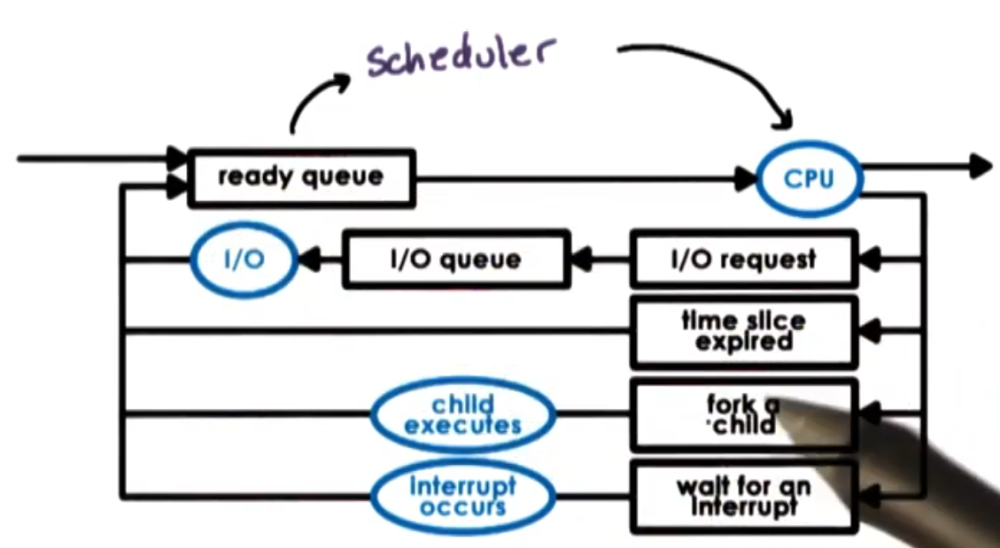

## Overview

**CPU scheduler** -- component of OS that decides how and when processes and their threads access shared CPU.
We will use term *task* -- process or thread.

Scheduler schedules tasks running *user-level processes/threads* as well as *kernel-level threads*.

Scheduler chooses one of the task in *ready queue* to run on CPU.

Scheduler runs when

* CPU becomes idle (for ex. task perform IO op.)
* New task becomes ready (to check if new task has higher priority, and if then, interrupt current task)
* Timeslice of current task expires

Once scheduler selects a thread to be scheduled, thread is *dispatched* on CPU: context switch, enter user mode, set PC and go!

So, *scheduling* is choosing task from ready queue. But which task should be selected depends on scheduling policy/algorithm. How task is retrieved from ready queue depends on *runqueue* structure.

Usualy type of runqueue and scheduling algorithm are tightly coupled.

### Scheduling algorithms

Metrics (that we need to compare algorithms): 

* Throughput ($\frac{\text{total number of tasks}}{\text{total amount of time to complete them}}$)
* Avg. job completion time
* Avg. job wait time
* CPU utilization

## Run-to-completion scheduling

As soon as a task is assigned CPU, it will run until it finishes or until it completes.

Assumptions:

* We have group of task/jobs that we need to schedule (can assume that they are arrived at same time)
* Known their execution times
* No preemtion (that is what means "to-completion")
* Have a single CPU

# First-come first-serve algorithm (FCFS)

* Schedules tasks in order of arrival (regarding their execution time, load of CPU etc.)
* Runqueue structure: simple FIFO queue 

# Shortest Job First (SJF)

* Schedules tasks in order of their execution time
* Runqueue structure: 
  * FIFO queue, ordered by execution time
  * or tree with key=execution time

## Preemptive scheduling

Assumptions:

* Task not arrive at same time

# Shortest Job First (SJF)

* When new task enter new queue (or current task completes), scheduler is being invoked, and compare
execution times and decides if it should preempt current task (if new task is shorter).
* Execution time of a task is unknowned and depends on too much many factors,
so we use some heuristics based on history (how long did a task run last N times).

# Priority scheduling

* Tasks have different priority levels
* All same as SJF, but for deciding "should we preempt current task" we use task's priority values.

# Priority inversion

Priority inversion -- phenomenon that occurs when we introduce priorities in scheduling and
use mutex locks.

If task with low priority T3 lock mutex, and then it has been preempted by newly arrived
task with higher priority T2, and then new task arrived with even more priority T1, 
and this new task also aquire same lock, then task T2 will run until completed,
then T3 until unlock mutex, and only then T1 will run until completion. So order here
will be T2, T3, T1, but we expect that T1 will be finished first.

*Solution:* temporary \textit{boost priority} of mutex owner. So T3 and T1 will have
same priority and after T1 blocked by aquiring mutex, T3 will be running until completion, 
then T1, and only then T2.

## Round robin scheduling

* Pick up first task from queue (like FCFS)
* Task may yield, to wait on I/O (unlike FCFS) and will be placed in end of queue, and next 
task in queue will be scheduled.

# Round robin with priorities

* Task preempted not only when waiting on I/O, but also when new task
with higher priority arrived.
* If multiple tasks have same priority, scheduler will schedule them in round robin manner
until they complete.

# Round robin with interleaving
* Tasks run not until they complete or request I/O operation,
but also limited with some fixed time interval, and then they are being preempted.
That called **timeslicing**.

## Timeslicing

**Timeslice (time quantum)** -- maximum amount of uninterrupted time given to a task.

But task may run less than timeslice time (has wait on I/O, synchronization, ...) and
in that case will be placed on a queue.

Also if we have a priorities in scheduling, current task may be preempted by 
new task arrived with higher priority.

Benefits of timeslicing:

* Short tasks finish sooner (lower *avg. wait time*)
* More responsive
* Lengthy I/O ops initiated sooner

Overhead: Interrupt running tasks -> overhead on context switch and 
schedule invoking (lower CPU utilization than on run-to-completion).

So keep $timeslice >> context switch time$.

If we increase timeslice: 

* *throuput* will increase (it is good) because of lower overheads on context switching (less context switches)
* but *avg. wait* will also increase (it is bad)
* *avg. completion* will decrease (it is good) because of lower overhead

If $timeslice = \infty$, it is run-to-completion, so we have maximum throuput, minimum avg.completion,
(because there are no overheads to context switch at all), but have also maximum avg. wait time.

# Timeslice length for CPU-bound

For CPU bound tasks we prefer larger timeslice, because we have no reason
to interrupt running (not waiting) tasks for maximum CPU utilization (and maximum throuput,
minimum avg. completion time).

# Timeslice length for I/O-bound

For I/O bound tasks we should decrease timeslice to initiate I/O operations earlier, and
very likely tasks will be preempted because of I/O operation, but not because of timeslice expired.
However unfortunatly we have big overhead in context switches (lower throuput, higher avg.
completion time) when interrupting running tasks because of timeslice expired.

## Runqeue data structure

Runqueue may be usual queue, multiple queues (one for every priority), or tree.

If we want different timeslices for I/O and CPU bound tasks, then have 2 options:

* Same runqueue, check type
* Two different structures (for CPU and I/O bound tasks)

## Multi queue

Multi queue data structure has multiple separate queues.
For first queue, we associate lowest timeslice -- this is queue for most I/O 
intensive tasks. For second queue timeslice is bigger, and so on.
For last queue timeslice is biggest, for example infinity (it is queue with 
run-on-completon FCFS policy) -- this is queue for most CPU intensive task.

Depending on task that we have we place it in appropriate queue.

Benefits:

* Timeslicing benefits provided for I/O bound tasks
* Timeslicing overheads avoidedd for CPU bound tasks

But how do we know if a task CPU or I/O intensive, and how much?

* History based heuristics (analyzing previous completed cases). But we don't know this
for new tasks and for tasks that dynamically change phases in their behaviour.
* Multi-level feedback queue (MLFQ)

# Multi-level feedback queue (MLFQ)

We will use previous multi-queue data structure, but will
move tasks from one level to another dynamically while scheduling:

* Tasks enter topmost queue (with lowest timeslice)
* If the task stops execution due to I/O operation, so we made good choice to place it here.
* If the task is preempted because of timeslice expired, so we move this task to one
level lower (to queue with bigger timeslice).

MLFQ is not equvivalent of queue ordered by priorities:

* Different treatment of threads (policies) at each level
* Feedback mechanism (dynamically adjust timeslice for task)

## Scheduling on Multi-CPU systems

If thread is scheduled on one CPU and then on another, cache will be COLD.

We want try to schedule back on same CPU where it is executed befor (cache-affinity)

To achieve:

* keep tasks on the same CPU as much as possible
* hierarchical scheduler architecture
  * at a top level -- load balancing component that divides tasks among CPU's,
  and a per-CPU scheduler (with per-CPU runqueue) repeadedly schedules tasks
  on given CPU as much as possible.

Load balancers balances:

* based on queue length
* or when CPU is idle

Memory nodes can have fast interconnect with some subset of CPUs and
those CPUs access memory faster (Non-Uniform Memory Access platforms). So
when scheduling, try to schedule tasks on those CPUs, that are close to same
memory node as previous
