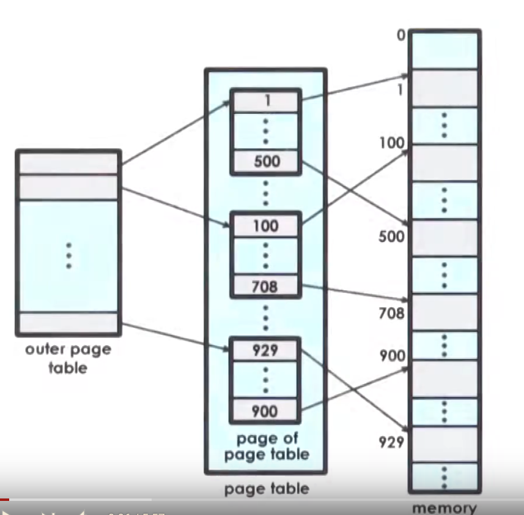

### Memory management

## Goals of mm

*Goal*: manage physical memory (DRAM) on behalf of one or more executing processes.

We decouple virtual and physical addresses. Virtual address space may be much larger
than actual physical memory, because:

* not all virtual addresses necesserily are mapped to physical memory (only those that used)
* some portion of physical memory swapped on disk

Two main goals:

* Allocate -- how physical memory is used and what is free among physical memory
* Arbitrate -- OS should be quickly able to preform virtual address translation and validation

Virtual address spaces subdivided into **pages** of fixed size. Physical memory
divided into **page frames** of the same size as pages. Role of allocation is 
to map *page* to corresponding *page frame*. Arbitration is done via *page tables*.

Paging is not the only way to decouple virtual and physical memories, there are
also *segment-based* memory management. It doesn't use fixed sized pages, but
flexibly sized segments that can be mapped to some regions in physical memory. Arbitration
uses **segment registers** to validate access.

## Hardware support

Every CPU unit has built-in Memory Management Unit (MMU), that:

* translates virtual to physical addresses
* reports faults: illegal access, permission

There are also special registers, that

* is pointers to page table (in page-based mm)
* has values of base and limit size, number of registers, etc. (in segmend-based mm)

Typcally MMU integrates a small cache of valid VA-PA translations -- **Translation Lookaside buffer**
(TLB).

Actual PA generation done in hardware, however OS should give it page tables to perform translation,
and allocation, replacement algorithms implemented in software.

## Page tables

Page-based mm is most popular mm type.
Page table -- collection of page entries, where every page entry
maps only first address of every virtual page to first address of 
corresponding page frame.

So, every virtual address consists of 2 parts: 

* Virtual page number: number of page in which this address lays
* Offset in that page

VPN (virtual page number) used to produce physical frame number (PFN). 
Actual physical address is PFN + Offset.

Important to note, that mapping from VPN to PFN created only 
when some address in that virtual page is first accessed.

Unused pages are reclaimed.

Page entries have not only VA->PA mapping, but also some bits,
that signals validity of corresponding PA (is it exists in DRAM, or it swapped on disk, etc.).
If hardware detected that the mapping is invalid, it will fault and pass control to OS. On fault,
there will be a mapping that will reastablish between valid virtual address and a valid location
in physical memory.

Page tables are *per process*. On context switch, OS switches to valid page table of process
(for ex. on x86 platform, OS will update register CR3, that points to currently active page table).

## Flags in page table entry

There more than 1 flag in page table entry:

* Present (valid/invalid) -- whether the contents of virtual memory are actually present in physical memory
* Dirty -- get set whenever a page is written to
* Accessed (for read or write) -- wheter the page has been accessed for read/write in some period of time.
* Protection bits -- whether page may be only read, only write or both (0 for read only, 1 for read + write).
* U/S bit -- whether page may be accessed only from supervisor (privileged) mode only, or in usermod too
* Others: caching related info (write through, caching disabled, etc...)
* Unused for future

MMU use page table entries not just to perform address translation, but relies on these bits
to establish validity of the access. If the HW determines that a physical memory access 
cannot be performed, it causes a page fault: CPU will place error code on kernel stack,
and then generate a trap into kernel. That will invoke a page fault handler, that
determuines action based on error code and faulting address. For example, it may be caused
because of page frame not in memory and it is just needed to be brought from disk to memory,
or it may be protection error (OS will generate signal SIGSEGV to process, that tries access that memory). Error code is generated from page table entry flags, and faulting address is stored in CR2 
register.

## Page table size

Let's calculate page table size. We have a number of page table entries equal to number of virtual pages.
Assume that

* 32 bit arch
* page table entry size = 4 bytes, including PFN + flags
* page size = 4kB

2^32 / 4kB(=2^12) = 2 ^ 20 virtual page numbers.
2 ^ 20 * 4B = 4Mb -- page table size. And it is *per process*.

Same page table on 64 bit arch will be 32 petabytes (10^15 bytes).

To reduce this, we want to

1. do not have mapping entry for unused virtual pages
2. even do not have mapping for those parts of used virtual pages, that are not used

To accomplish 2-nd, we introduce hierarchical page tables (to accomplish 1-st we just should not add entries for unused pages).

## Hierarchical page tables
Instead of flat page tables, we consider multi level page tables. 

Outer page table elements not pointers to actual frame pages, but to internal page tables.
Outer page table called **page table directory**. Internal page table -- only for valid virtual memory regions.

Now, virtual address has 3 parts: p1, p2 and d: p1 -- number of page table in page table directory, p2 -- number of 
page table entry in internal page table, and d -- offset in page frame. 

There may be even 3 and 4 levels.

* (+) smaller internal page tables/directories => reduces page table size
* (-) more memory accesses required for translation

## Translate Lookaside Buffer (TLB)

TLB -- MMU-level address translation cache. On TLB miss -- page table access from memory. TLB will also contain
all of the necessary protection and validity bits to verify if access is correct or, if necessery, generate a fault.

TLB is NOT CPU cache (TLB contains translations VA to PA, CPU cache contains values)

## Inverted Page Tables

Inverted page tables -- completely different way to oragnize translation process. Logical address consists is 
[pid | p | d]. We have one page table with entries (pid, p). To perform translation, we do linear search
through table to found pair (pid, p). When found, index of this entry is a page frame number. Then 
add offset d.

* (-) linear search (TLB resques)

# Hashing page tables
Logical address is [p | d]. We have hash function that applies to p and returns index in page table.
Page table entry is a linked list of possible translations, [q | s]. Then we do linear search to find q == p in that list,
and take s as page frame number.

## Segmentation
