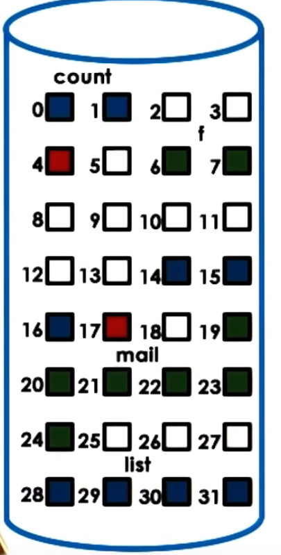
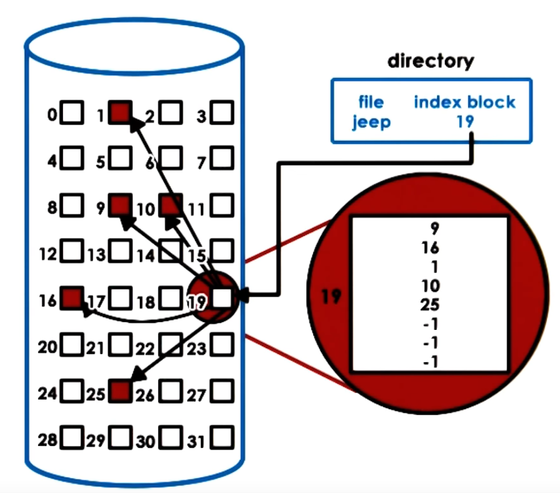

### IO management & file systems

There are many other HW components, that provide input or output capabilities:
mouse, keyboard, display, network card, disk, etc.

## Basic I/O device features

Any devices will have 

* Set of control registers, that is accessed by CPU and permit the CPU to interact with devices:
  * command -- CPU uses it to control what exactly the device will be doing
  * data -- CPU uses it to control the data transfers in/out of the device
  * status -- CPU uses it to find out what's happening on the device
* Microcontroller -- device's CPU (optionally), it controls all of the operations that take place on the device
* On device memory
* Other logic, for ex. analog to digital converters.

## CPU -- device interconnect

Device interface with the rest of the system via *controller* that typically integrated as part of the 
device packaging, and used to connect the device with the rest of CPU complex via some device *interconnect*.

Example of this interconnect is PCI bus (peripheral component interconnect), SCSI bus (for disks), etc.

Controllers that are part of the device's HW determine what type of interconnect can a device directly
attach to. But there are bridging controllerse that can handle differences in different type interconnects.

## Device drivers

OS supports devices via **device drivers**, that are part of kernel I/O subsystem.

Device drivers:

* per *each device type*
* responsible for device access, management and control
* typically provided by device manufacturers per OS/version
* each OS standardizes interface for driver development (give some framework)
  * (+) device independence (OS do not required to support concrete devices)
  * (+) device diversity (devices can be eaisly changed, and all is needed to change drivers, all other OS components are the same)

## Type of devices

* Block (like disk)
  * read/write *blocks* of data
  * direct access to arbitrary block
* Character (like keyboard)
  * has functionality to get/put character
* Network devices -- mean between block and character
  * they deliver not a one character, and not a block of fixed size, but flexible sized portions of data

Interfaces that OS exposes to driver developers are fixed per type of device.

OS representation of a device -- special device file (in Linux in /dev, and these files treated by tmpfs or devfs filesystems)

## CPU-Device interactions

The main way in which PCI interconnects devices to the CPU's is by making devices
accessible in a manner that is similar to how CPU access memory. 

Two methods how CPU interact with device:
# Memory mapped IO

Devices registers appear to the CPU as memory locations at a specific physical address. When CPU writes to those locations,
integrated memory PCI controller realizes that this access should be routed to the appropriate device.

* part of 'host' physical memory dedicated for device interconnections
* portion of the memory that is reserved for these interactions is controlled by a specific set of 
registers, called **base address registers**; it is configured during boot process

# IO port

* dedicated in/out instructions for device access
* each instruction takes target device (I/O port) and value in register (that needs to be written out to device or read out of the device)

Two methods how device interact with CPU:

# Interrupt
Device can generate interrupt to CPU

* (-) interrupt handling routine -- setting and resetting interrupt mask, cache pollution.
* (+) can be generated as soon as possible

# Polling
CPU can read status register of device (does device have some data for CPU, does it have a request that was sent to the CPU, etc.)

* (+) when convenient for OS (when cache polution is not critical, etc.)
* (-) delay; CPU overhead (for pollin)

## Programmed IO (PIO)

This method allows CPU to request an operation from a devices, without no additional 
HW support (its enought just basic PCI). It involves the CPU issuing instructions
by writing into the *command* registers of ther device and controlling data movement
by accessing the *data* registers of the device. Data register will be set as many time
as it needed to tranmiss all packet (in case of network device type).

## Direct Memory Access (DMA)

Relies on HW support (DMA controller). For devices that have DMA support, the way the CPU 
interacts with them is 

* it would still write commands in command register on the device
* data movement will be controlled by preconfiguring DMA controller (which data would be moved from CPU memory to the device) --
specifying in-memory address and size of packet buffer

Same method may be used for moving data from device to CPU (backwards). So device should also interact with DMA controller.

* (+) faster than PIO
* (-) DMA configuring is more complex, for small data tranfers PIO is more preferable

For DMA, data buffer must be in physical memory (cannot be swapped on disk).

## Typical device access
User process - (send data) > kernel - (form packet) > driver - (configure device's registers) > device

## Sync vs Async access

Synchronouse IO operations:

* process blocks

Asynchronous IO operations:

* process continues, and later:
  * process checks and retrieves result, OR
  * process is notified that operation completed and results are ready

## Block devices

Processes use files -- logical storage unit.

Below file-baesd interface there is **file system**. FS will have an information
how to take reads/writes that are coming from the application and determine
where physically file is, how to access it, then perform permission checks, 
and then initiate the actual access.

OS provides flexibility in the actual details that a file system has in
terms of how it lays out on disk, how it performs access operations. 

OS specifies filesystem interfaces. This includes both the interfaces that are used 
by app to interact with fs (for ex. POSIX API), and standardizing the filesystem 
interfaces -- how these fs interact with underlying storage devices.

OS introduce **generic block layer** that standardized block interface, that FS
is interacting to. That generic block layer is implemented by particular driver.

Summarizing: FS finds out *what* block is accessed (in terms of generic block layer),
and then performs block operation (read/write) by interacting to driver of block device.

## Virtual filesystem (VFS)

We can change FS without changing user application. Also we can change device,
without changing both FS and user application. 

But what if files are on more than one device? What if device work better with
different FS implementation? What if files are not on a local device (accessed via network)?

OS introduce VFS layer. VFS abstracts details about concrete implementation of FS and provides
some interface interface for user application (it is same type of API that is for 
usual FS, for ex. POSIX). Underlying VFS there may be multiple VFS, that corresponds to 
different disks or even network.

## Virtual filesystem abstractions

VFS supports several key abstractions:

* **file** -- elements on which the VFS operates
* **file descriptor** -- OS representation of a file, first created when file first opened, per process.
  * Operations that require file descriptor: open, read, write, sendfile, lock, close, ...
* For each file VFS maintains a persistent data structure called **inode**
  * list of all data blocks, that corresponds to this file
  * device on which file lays, permissions, size, ...

inode is needed because file does not necesserily lay on contigious block on disk.

Directory is just a file, except it's contents include info aboud files and their inodes (contents is mapping between filenames and inodes). VFS will
interpret the contents of the directory a little bit different.

**dentry** -- directory entry, corresponds to single path component. For ex. when accessing
directory /home/user, VFS will create a dentry elements for /, /home, /home/user.

Benefit of dentries is when we need to access a file stored in /home/user/, we don't have to
through entire path and try to reread files that corresponds to all of these directories (/, /home, /home/user)
to get our file. Filesystem will maintain **dentry cache** for all files we accessed.

**superblock** -- filesystem-specific info about FS layout.

## VFS on disk

VFS data structures are created and maintained by OS's fs component. But, opposite to dentries that stored in RAM, inodes
are persists on disk with the files they related to.

On pic. we have 2 files (green and blue), and their inodes (red).

## inodes

inodes plays key role in keeping track how file is organized on disk. All file's contents completely 
determined by file's inode. inode itself are uniquely numbered, so by number of inode we can get all
file's content. inode contain list of all file blocks + other metadata (if file access is legal, status of the file, is file locked, etc.)
So, filename is mapped to inode (number). 

* (+) easy to perform sequential or random access
* (-) limit of file size: e.g. 128 byte inode, 4 byte block ptr => 32 addressible blocks => 32 * 1kB block = 32 kB file size

Modification to increase file size limit: indirect pointers. With indirect pointers mechanism, inode contains:

* metadata
* pointers to blocks
* pointers to list of blocks (single indirect)
* pointer to list of pointers to list of blocks (double indirect)
* triple indirect

* (+) small inode => large file size
* (-) file access slowdown (more disk accesses to finally reach block: in single indirect - 2 accesses instead of 1, in double - 3, etc..)

## Disk access optimizations

* caching/buffering file contents => reduce disk accesses
  * read/write from cache
  * periodically slush to disk -- fsync()
* IO scheduling => minimize disk head movement
  * maximize sequential vs random access
  * for ex: write block 25, write block 17 => write 17, then write 25
* prefetching => increase cache hits
  * leverages locality
  * for ex: read block 17 => read also 18, 19 in cache
* journaling/logging => reduce random access
  * "describe" write in log: block, offset, value; but not do actual write on disk
  * periodically apply updates to proper disk locations in proper order
  * used in ext3, ext4
