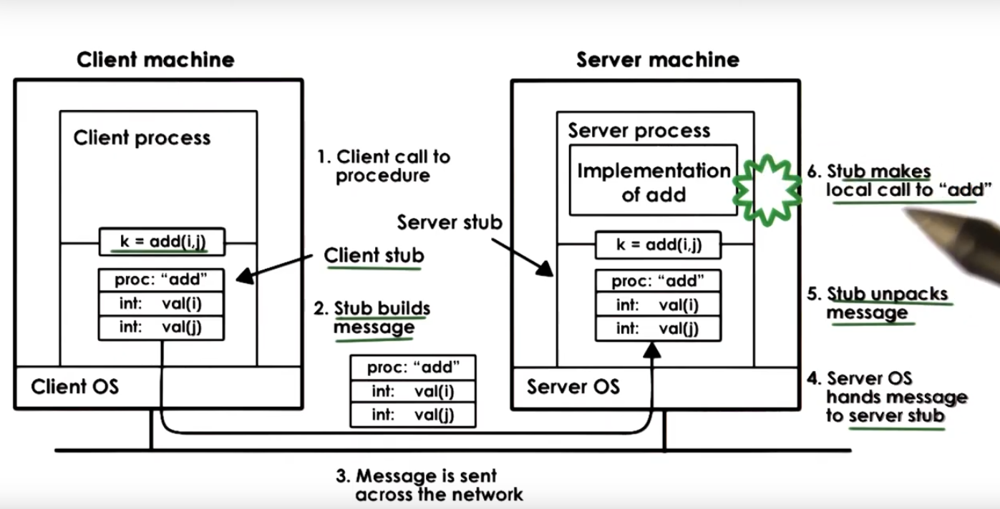

## RPC

Remote procedure call (RPC) is needed to simplify cross address space and 
cross machine interactions and
to do not require from programmer to do some common steps in these interactions: 

* create and init sockets
* allocate and populate buffers
* include protocol info (metadata for request)
* copy data into buffers
* and so on...

# Benefits

* Higher-level interface for data movement and communication (doesn't need to create sockets,
buffers etc.)
* A lot of error handling are automated and a programmer doesnt have to worry about it (at
least not all types of error)
* Hides complexities of cross-machine interactions: machines may have different types,
network between them may fail, machines may fail etc.

# RPC requirements

1. Need to match client/server interactions (server must provide functions, and client
doesn't need to have same capabilites as server)
2. Synchronous call semantics (just as usual procedure call) -- block until procedure complete.
3. Type checking (if we pass arguments of incorrect type we receive an error)
4. Cross-machine conversion (for ex. big/little endian)
5. Higher-level protocol (than tcp/udp) -- access control, fault tolerance, different transport
protocols.

# RPC structure

# RPC steps

-1. Register: server "registers" procedure, args types, location ...
0. Bind: cliend finds and "binds" to desired server
1. Call: client makes RPC call; control passed to stub, cliend code blocks
2. Marshall: client stub "marshals" arguments (serialize args into buffer)
3. Send: client "sends" message to server

4. Receive: server receives message; passes message to server stub
5. Unmarshall: server stub "unmarshals" args (extracts args and creates data struct)
6. Actual call: server stub "calls" local procedure implementation
7. Result: server performs operation and computes result of RPC operation

And similar steps on return.

# Interface Definition Language
What can the *server* do? What arguments are required for the various operations?
We need **agreement**.
Why:

* client-side bind decision
* runtime to automate stub generation, marshalling procedures, etc.

**IDL** -- protocol how this agreement will be expressed. It is used to describe the interface
the server exports:

* Procedure name, args and result types
* Version

IDL may be *language agnostic* (for ex. SunRPC has IDL called XDR) and *language specific*
(for ex. JavaRMI). IDL does not define actual implementation of the service.

# Marshalling

Marshalling is placing variables, that lays separatly in memory, in contigious layout (buffer)
to send buffer via network.

Special case is how send pointers with RPC. There are 2 approaches:

* restrict pointers as arguments/result types
* allow pointers, but when serializing, we serialize pointed data, and while
deserializing, we create data in local address space and get a pointer to that data

# Unmarshalling

When we receive message, we have byte array. Unmarshalling is a process of creating
data structures in local address space (they will lay non contigious) from buffer.

# Binding

Binding is a mechanism used by client do determine which server to connect to.
It depends on service name (procedure name), version number, etc.
To connect to server client must know it's ip address, network protocol and other details.

Registry -- database of available services. It is used for searching for service name to
find service (which) and contact detailse (how).

Registry can be some distributed online service that any rpc server can register with.
Client go to that registry to find rpc server that provide functionality and contact details.

# Java RMI (remote method invocation)

* Interactions among address spaces in JVM
* matches Java OO semantics
* IDL -- language specific
* Client stub called *stub*, server stub called *skeleton*.
* RMI runtime has 2 layers: 
  * Remote reference layer (unicast, broadcast, return-first response, return-if-all-match)
  * Transport layer (TCP, UDP, shared memory, ..)
