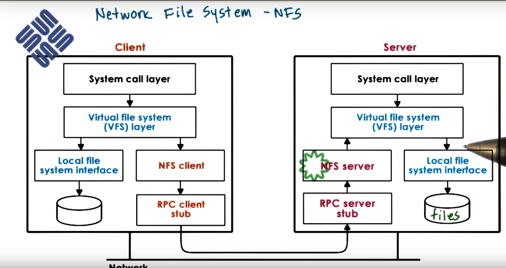

### Distributed file systems

FS under VFS may be even not stored on local storage, but 
maintained on other machine and accessed via network.

Multiple machines, that are envolved in delievery FS service,
together form a *distributed file system*.

## DFS models

**DFS** -- an FS that can be organized in any of the following ways:

* client/server on different machine
* file server distributed on multiple machines:
  * replicated (each server maintains replicas of all files) -- good at failures and increase availability
  * partitioned (each server maintains part of files) -- good scalability (less overheads than replicated model)
  * combination of both (file partitioned, each partition replicated)
* files stored on and served from all machines (all nodes are peers) -- this blurs distinction between client and server machines

## Remote file service

Assume one client and one server.
# Extremes

1. Upload / Download: client downloads file, make changes, and uploads it on server back

  *  like FTP, SVN
  * (+) local reads/writes at client
  * (-) entire file download/upload even for small modifications
  * (-) server gives up control

2. True remote file access: every access to remote file, nothing done on local FS; every read and write is 
a request to a server

  * (+) file accesses centralized, controlled; easy to reason about consistency; no situation when
    multiple clients changes same portion of a file
  * (-) every file operation pays network cost
  * (-) limits server scalability (server will get overloaded more quickly)

# Compromises (practical model)

1. Allow clients to store at least some parts of file locally (blocks); or even allow prefetching
  * (+) low latency on file operations
  * (+) server load reduces => more scalable
2. Force clients to interact with server frequently
  * (+) server has insights into what clients are doing
  * (+) server has control into wgich accesses can be permitted => easier to maintain consistency

But server more complex, requires different file sharing semantics.

## Stateless vs. Stateful file server

**Stateless** -- keeps no state, every request has to be self-described, self-contained, so that
it has all parameters (file name, absolute offset in it, ...) to reproduce it. It is ok with extreme models,
but cannot support practical model.

* (-) cannot support caching and consistency management
* (-) every request self-contaned => more bit transferred
* (+) no resources are used on server side (CPU/memory) to achieve consistency
* (+) on failure, just restart server

**Stateful** -- keeps client state; needed for practical model to track
what is cached/accessed.

* (+) support locking, caching, incremental operations (client may request, for ex., "next" 1kB of file; it is
impossible with stateless design, where all info is provided in request)
* (-) need checkpointing and recovery mechanism for failure cases
* (-) overheads to maintain state and consistency that depends on caching mechanism and consistency 
protocol

## Caching state in DFS

* locally clients maintain a portion of state (e.g. file blocks)
* locally clients perform operations on cached state (e.g. open/read/write agains locally cached files or file
portions); no overloading of file servers

It requires **coherense** mechanisms: if client1 changed some file, client2 that changing same file must 
be notified about client1's changes. Ways:

* How: client/server - driven (either client requsts cache update, or server pushes notification to clients)
* When: on demand/periodically/on open/...

Details depend on file sharing semantics that DFS needs to support.

## File sharing semantics

On single machine: if process A edits file, process B that opened that file will immediatly see those changes
when performing read.

On DFS: if process A edits file and immediatly send changes to server, process on other machine
maybe couldn't see those changes because of network delay in transporting packets from first process to server.

File sharing semantics in DFS:

* UNIX semantics: every write visible immediatly
* Session semantics: whenever file is closed by client, client writes back all changes on server that is in cache;
  on open client goes and checks on file server if there a new version of a file. Session is a period between
  open and close. It is easy to reason, but may be insufficient.
* Periodic updates: client writes back periodically (clients have a "lease" on how long they use cached data);
  server invalidates client's caches periodically by sending notifications -- that provides bounds on "inconsistency"  . FS can provide flush()/sync() with these semantics.
* Immutable files: never modify, only new files created.
* Transactions: all changes atomic. It is done by server providing special API with these transactions.

## File vs Directory service

Two types of files: *regular files* vs. *directories*. We should choose different policies for each.

For ex.1: *session-semantics* for files, *UNIX* for directories.

For ex.2: *less frequent write-back* for files than directories.

## NFS

In NFS clients acccess remote server over a network. Clients requests an access files
using the VFS interface and using same types of file descriptors that they use to access
files in their local storage. VFS layer will determine whether the file belongs to
the local FS or wheter it needs to be pushed to the NFS client that passes it to remote file system.

NFS client interacts via RPC with the RPC server that resides on remote machine (that machine actually stores
the file). NFS server get requst and issue operation to a local VFS and then got passed to local file.

On open operation, NFS server creates **file handle** -- byte sequence that encodes server and local file info.
It is returned back to client and maintained by NFS client. Then on every access of file NFS client
passes that file handle to server. If file is deleted on server machine or even server dies, using that
file handle will result in error. Read/write operations is done via RPC. 

# Versions 

Since 80s, currently used versions of NFS are *NFSv3* and *NFSv4*. 

* NFSv3 -- stateless (incorporate additional modules for caching and locking)
* NFSv4 -- stateful (supports caching and locking)

Caching:

* session-based for file that are not accessed concurrently
* periodic updates (3sec for files, 30 sec for dir by default)
* NFSv4 delegates to client ofr a period of time (avoid 'update checks')

Locking:

* lease-based: client aquires a lock, server assignes a time period during which a lock is valid. Client may
release lock or extend lock duration explicitly.
* NFSv4 also supports RW-lock "share reservation"
